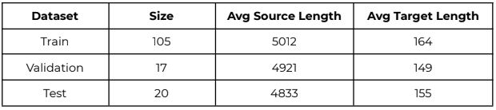
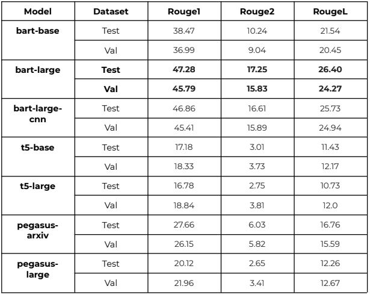

## Overview

The goal of this project is to train a summarizationmodel, specifically for meeting
conversations. This presents a more complex situationthan news summarization as
the content of each meeting is much more than an averagenews article. The
sentences in meeting transcripts are less informationdense, in comparison to news
articles, as there are a lot of affirmations, passingremarks and repetitions. There is
also a particular structure to most summaries whereevery individual’s contribution
to the meeting is specified and key points discussedare included hence it is
important to preserve this structure. Thus the problemcan be broken down into two
main subproblems:

1. Cleaning the given source transcript and obtaininginformation rich
    sentences. This step is important to make the inputpalatable to the existing
    models which have constraints in terms of max inputlength. I employ
    pretrained open-source extractive summarization modelsto achieve this.
2. Effectively fine tuning a pre-trained model to preservestructure of given
    summaries and obtain the highest rouge scores forthe same. I use
    pre-trained abstractive summarization models fromhuggingface.

## Data

The given preprocessed dataset had the following properties:


As we can see the average source length is about 4times larger than the input
sequence limit of any standard summarization model.The average target length


however is quite small indicating that the summary is a highly condensed version of
the input.

## Preprocessing

As specified in subproblem 1, it is necessary to extractinformation rich sentences. As
the given transcripts have 5012 words on average andthis has to be condensed to
1024 tokens as this is the limit for most abstractivesummarization models. I tried a
couple of methods such as pytextrank and gensim, theyare both described in more
detail below. However before using either of thesemodels I performed preliminary
cleaning of affirmation words and other annotatedsounds such as “m’kay”, “um”,
“hmm” etc. I also removed stutter words which wererepresented as a single letter
followed by the intended word as these appeared quiteoften in the corpus and were
being reproduced in the final summary. In additionto these steps I only considered
sentences which have 3 or more words to discard randombreaks and pauses in
sentences which were separated by a period in thesource corpus.

P 1 .PYTEXTRANK :Using pytextrank’s pretrained summarizerto extract a transcript
which is roughly around 1024 sentences. Pytextrankemploys a page rank type
algorithm to score sentences based on their informationcontent.

P 2 .GENSIM :Gensim summarizer is also an extractivetext summarization tool which
uses the pagerank/textrank algorithm. It was howevereasier to use as it gives a
summary which preserves the order of the given sentencesdirectly and is quite fast.

Once the condensed version of the source is availableit is tokenized using the
pretrained fast tokenizer provided by huggingfacewhich are model specific. It is
important to use the tokenizer which corresponds tothe specific model as all 3 of
them follow different conventions for their specialtokens. It would have been
possible to employ a universal tokenizer keeping inmind a unique special token
mapping for each of the models but it is just moreconvenient to use the ones that
are readily available. Once the tokenized inputs areavailable the train, validation and
test dataframes are converted to datasets using thetorch’s Dataset module so as to
make them compatible with transformers’ trainer module.

## Scoring Criteria

The scoring criteria used to evaluate the models arerouge1, rouge2 and rougeL.
These are the standard scoring metrics used for summarizationmodels as they help
us understand the similarity between two pieces oftext. I hope to achieve the scores
of the current SOTA (HMNET) which has{ 53. 02 ; 18. 57 ; 24. 85 }scores respectively.


## Model training

For training the abstractive summarization part ofthe pipeline, I tried several models
from the huggingface pretrained model suite such aspegasus, bart and t5. The best
model based on the scoring criteria was the bart-large.In addition I used the
meeting summarization model HMNet (microsoft) as agoal for the summarization
model.



Observations-
● There is a problem of truncation with each of themodels, in the sense that the
last sentence is abruptly ended before the end ofsentence token is reached.
This issue was noticed only when training in batchesof >1 but not when batch
size was 1. I was unable to solve this issue due towhich the trailing incomplete
sentence was discarded. This led to some loss of informationfrom the final
summary which reduced the final rouge scores.


```
● As the model was trained for more epochs it adopted the structure of the
ground truth summary better, however with further training it started to
discard unique information from the source and learnedto output very similar
summaries which were structurally very sound butpoor in their quality of
content. Hence I found 5 epochs to be the sweet spotfor fine tuning.
```
```
● Since these models are extremely large and have beentrained on billions of
lines of text data, it requires a large amount ofdata to effectively finetune all
the weights of the model and multiple gpus to trainthe entire model at the
same time. To counter these two shortcomings I frozethe weights of the
encoder to decrease train time and the size of theupdatable model. I did
however notice that there was a very small drop inrouge scores
(approximately 1 point in each) and hence this didnot leave a detrimental
effect to the performance of the model. Freezing theencoder weights allowed
me to load the model and train with a batch size of4 whereas without
freezing allowed only a batch size of 1. A model trainedon batch size of 1
showed a lot of variation in its test results andgenerated rather short
summaries with not a lot of information.
```
Training Hyperparameter choices :

```
● A batch size of 4 (with encoder weights frozen) wasused as this was the
highest achievable considering that I was using thefree gpu on colab.
```
```
● Training was done for 5 epochs for the reason listedabove in the observations.
```
```
● The inputs were padded/truncated upto the maximumlength to allow batch
training to happen. The maximum input length was 1024,which is pretty
standard, whereas the maximum output length was 180.This is slightly higher
than the ground truth summaries, however I noticedthat all 3 models provide
rather short summaries and since the last sentenceis discarded due to the
truncation problem I added about a sentence’s lengthto the maximum limit.
```
Decoding Hyperparameter choices :

```
● Due to the fact that the input was largely conversational,there is a lot of
repetition of phrases which leads to an assignmentof a high importance to
them due to the high frequency of occurrence. Thisled to some phrases being
repeated in the decoded summary hence, the no_repeat_ngram_sizewas set
to 3. In general, conditional generation models sufferfrom repetition and this
hyperparam counteracts that.
```

```
● I set top_p to 0.9 and top_k to 15 to prevent complete greedy decoding while
the model is creating the summary and to get morecomprehensive
summaries.
```
```
● The forced_eos_token_id was set to true to force thesummary to produce the
eos token once the max length is reached, howeverthis does not solve the
truncation problem.
```
## Conclusion

Hence an effective abstractive summarizer called bart-largewith a preprocessing
pipeline which employs an extractive summarizer fromgensim was fine tuned on
the ami dataset to achieve close to SOTA results.The final rouge scores obtained
were -

```
Dataset Rouge^1 Rouge^2 RougeL
```
```
Test 47. 28 17. 25 26. 40
```
```
Val 45. 79 15. 83 24. 27
```

